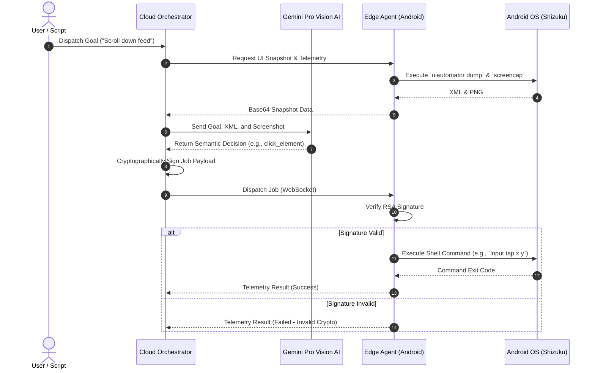

# 🗺️ High-Level Design (HLD)

The Tokiyo Edge Automation system is divided into two primary macro-components: the **Edge Agent** (Android Application) and the **Cloud Orchestrator** (Node.js Backend).

> [!NOTE]
> The primary design philosophy is a **Thick Cloud, Thin Edge** model. The Android Edge Agent executes commands and gathers sensory data, while the Cloud Orchestrator handles all heavy compute, ML parsing, and decision-making.

## 🏗️ System Architecture Overview

1. **Edge Agent (`shizuku-spike-sandbox`)**: An Android application built with Kotlin Coroutines. It connects to the orchestrator via WebSockets. It leverages `Shizuku` to execute ADB shell commands natively (e.g., `input tap`, `uiautomator dump`) without requiring root access.
2. **Cloud Orchestrator (`cloud-orchestrator`)**: A Node.js Express server. It manages connected edge nodes, stores telemetry in SQLite, and communicates with Google's Gemini Vision AI to determine autonomous UI interactions based on visual and semantic context.

## 🔄 End-to-End Data Flow

The following sequence diagram illustrates the lifecycle of an autonomous job execution.

