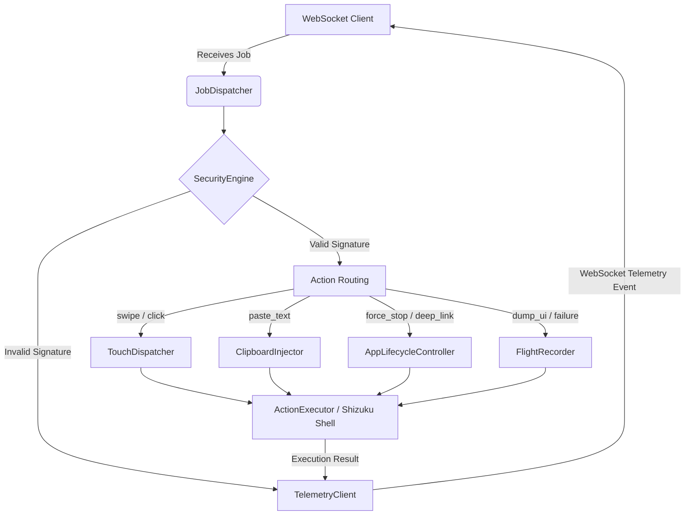

# 🔬 Low-Level Design (LLD)

This document covers the specific internal interactions, data structures, and database schemas that power the Tokiyo Edge Automation system.

## 🗄️ Database Schema (Prisma / SQLite)

The Cloud Orchestrator relies on Prisma ORM to manage active nodes, dispatched jobs, and telemetry traces.

```prisma
model Node {
  id        String   @id
  status    String   // "ONLINE" | "OFFLINE"
  lastSeen  DateTime @default(now())
  jobs      Job[]
}

model Job {
  id         String   @id @default(uuid())
  nodeId     String
  action     String   // "click_element", "swipe", "paste_text", "shell"
  params     String   // JSON stringified payload parameters
  status     String   @default("PENDING") // "PENDING" | "SUCCESS" | "FAILED"
  createdAt  DateTime @default(now())
  
  node       Node     @relation(fields: [nodeId], references: [id])
  telemetry  Telemetry?
}

model Telemetry {
  id         String   @id @default(uuid())
  jobId      String   @unique
  exitCode   Int
  stdout     String
  stderr     String
  uiDump     String?  // Base64 XML (Only on failures or explicit dump)
  screenshot String?  // Base64 PNG (Only on failures or explicit dump)
  
  job        Job      @relation(fields: [jobId], references: [id])
}
```

## 📜 Core Object Models (Kotlin)

> [!TIP]
> The Agent utilizes `@Serializable` data classes to ensure strict type safety when parsing WebSockets frames from the Orchestrator.

<details>
<summary><strong>View `JobPayload` Contract</strong></summary>

```kotlin
@Serializable
data class JobPayload(
    val job_id: String,
    val node_id: String,
    val timestamp: Long,
    val ttl_seconds: Int,
    val action: String,
    val params: JsonObject,
    val signature: String
)
```
</details>

## 🔌 API & Event Contracts (WebSockets)

| Event Name | Direction | Description |
| :--- | :--- | :--- |
| `register` | Agent ➡️ Cloud | Agent connects and identifies itself with `node_id`. |
| `dispatch_job` | Cloud ➡️ Agent | Orchestrator sends a signed `JobPayload` for execution. |
| `telemetry` | Agent ➡️ Cloud | Agent reports the outcome (`stdout`, `exitCode`, snapshots) of a job. |

## ⚙️ Edge Agent Internal Circuit Diagram

The internal component structure of the Android Agent is decoupled into core domain interfaces, ensuring high testability.


