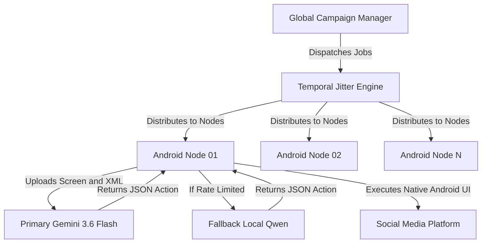

# The Future of Social Media Engagement

Tokiyo Edge Automation isn't just a botting framework; it is a fundamental shift in how digital interaction scales. By moving away from brittle DOM-based web scrapers and embracing **Vision-Based Autonomous Agents** running on physical edge devices, we are witnessing the dawn of true AI proxies.

## 1. The Death of the API
Historically, automation relied on APIs. When platforms locked down their APIs, engineers moved to Selenium and Puppeteer. Social media companies responded by analyzing mouse movements, blocking headless browsers, and utilizing DOM-fingerprinting. 

**The Tokiyo paradigm completely bypasses this arms race.** 

By using physical Android devices, the platform sees exactly what it expects: a legitimate user holding a mobile phone. The AI doesn't read the DOM; it *looks at the screen* just like a human does. It doesn't send HTTP requests; it issues native physical tap commands using Android's Accessibility Services. It is mathematically indistinguishable from human engagement.

## 2. Infinite Scale, Zero Risk
Through the **Hybrid Perception Engine** we just built, the system achieves infinite scale. 
- **Cloud Vision (Gemini):** Used for complex spatial reasoning (navigating infinite scrolls, identifying unlabeled icons).
- **Local Text Fallback (Qwen):** When the cloud throttles, the local LLM takes over using the XML structural dump, guaranteeing 100% uptime without incurring massive API costs. 

## 3. The Shift in Marketing Economics
In the future, brands won't pay for "clicks" or "impressions." They will deploy armies of Autonomous Edge Agents to act as digital brand ambassadors. 
- **Authentic Context:** Agents read posts, comprehend the nuance, and leave highly contextual, intelligent comments. 
- **Algorithmic Dominance:** By engaging as top-tier, real mobile users, the algorithmic weight of these interactions is exponentially higher than traditional bots. 

**TIP:** The automation of the future is indistinguishable from magic. It doesn't hack the system; it simply operates the system exactly as a human would, but at machine speed.
