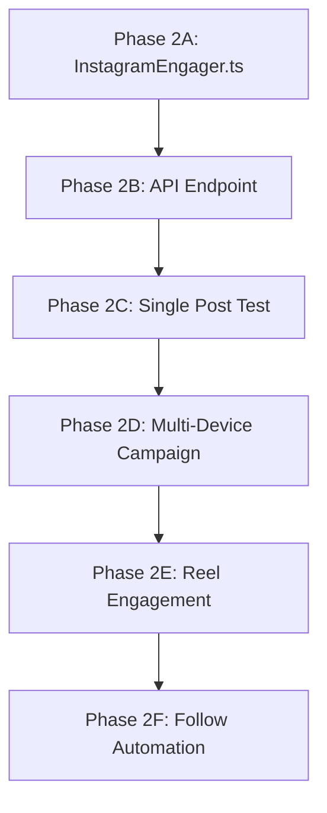

# 🎆 Phase 2: "Fireworks Start Before Diwali" — Instagram Automation

## Background

With LinkedIn v1.0.0 successfully shipped (6 verified comments, 5 likes across 3 devices), we are now expanding to **Instagram** — the platform with higher demand from real-world edge device operators across India.

This plan covers the deep APK analysis results and the technical implementation roadmap for Instagram engagement automation.

---

## APK Deep Analysis Results

### Instagram APK Profile

| Property | Value |
|---|---|
| **Package** | `com.instagram.android` |
| **Version** | `443.0.0.48.82` (Build `384910626`) |
| **Min SDK** | 28 (Android 9) |
| **Target SDK** | 36 (Android 16) |
| **APK Type** | Split APK (base + `arservices`, `executorch`, `pytorch`, `spm`) |
| **Base APK Size** | 143 MB |
| **Manifest Lines** | 6,195 |

### Deep Link Schemes (Verified Working on Real Device)

| Scheme | Example | Opens |
|---|---|---|
| `https://` | `https://www.instagram.com/p/{shortcode}/` | Post in feed |
| `https://` | `https://www.instagram.com/{username}/` | User profile |
| `https://` | `https://www.instagram.com/reels/` | Reels tab |
| `instagram://` | `instagram://explore` | Explore tab |
| `instagram://` | `instagram://user?username={name}` | User profile |
| `instagram://` | `instagram://direct-inbox` | DM inbox |
| `instagram://` | `instagram://media?id={media_id}` | Specific media |
| `ig://` | `ig://...` | Internal app scheme |

> [!IMPORTANT]
> **Key Finding:** `https://www.instagram.com/p/{shortcode}/` deep links open the post **inside the main feed** (not a standalone detail view like LinkedIn). This means the Like/Comment buttons appear inline after scrolling, not in a fixed overlay. The FSM must account for scroll-dependent button discovery.

### Engagement UI Elements (From Live Device Dump)

```
+----------------------------------------------------+
|  [row_feed_profile_header]                          |
|  Profile avatar | username | Follow | ...           |
|  content-desc="username posted a photo X ago"       |
+----------------------------------------------------+
|  [row_feed_photo_imageview]                         |
|  content-desc="Photo/Reel by X, N likes, N cmts"   |
+----------------------------------------------------+
|  [row_feed_view_group_buttons]                      |
|  Like  | Comment  | Share  |  Save                  |
|                                                      |
|  IDs:                                                |
|  - row_feed_button_like    (content-desc="Like")     |
|  - row_feed_button_comment (content-desc="Comment")  |
|  - row_feed_button_share   (content-desc="Send...")  |
|  - row_feed_button_save    (content-desc="Add...")   |
|  - reposts_ufi_icon        (repost/remix button)     |
+----------------------------------------------------+
|  Caption: username + "caption text..." + "more"      |
|  Timestamp: "8 hours ago"                            |
+----------------------------------------------------+
```

### Button Coordinates (Samsung S24 Ultra - 1440x3120)

| Button | Resource ID | Content-Desc | Bounds |
|---|---|---|---|
| **Like** | `row_feed_button_like` | `"Like"` | `[48,285][144,469]` |
| **Comment** | `row_feed_button_comment` | `"Comment"` | `[370,285][466,469]` |
| **Share** | `row_feed_button_share` | `"Send post..."` | `[886,285][982,469]` |
| **Save** | `row_feed_button_save` | `"Add to Saved"` | `[1255,285][1431,453]` |
| **Follow** | `inline_follow_button` | `"Follow {name}"` | `[931,1133][1264,1268]` |
| **More** | `media_option_button` | `"More actions..."` | `[1264,1105][1440,1297]` |

### Tab Bar Navigation

| Tab | Resource ID | Content-Desc | Bounds |
|---|---|---|---|
| Home | `feed_tab` | `"Home"` | `[0,2868][288,3060]` |
| Reels | `clips_tab` | `"Reels"` | `[288,2868][576,3060]` |
| DM | `direct_tab` | `"Message"` | `[576,2868][864,3060]` |
| Search | `search_tab` | `"Search and explore"` | `[864,2868][1152,3060]` |
| Profile | `profile_tab` | `"Profile"` | `[1152,2868][1440,3060]` |

### Key Activities

| Activity | Purpose |
|---|---|
| `LauncherActivity` | Cold start entry point |
| `InstagramMainActivity` | Main tab host (feed, reels, search, profile) |
| `FoaDeeplinkActivityAliasUniversalLink` | HTTPS deep link handler (exported) |
| `FoaDeeplinkActivityAliasAppScheme` | `instagram://` scheme handler |
| `UrlHandlerActivity` | Generic URL routing |
| `DirectExternalMediaShareActivity` | Share media to DM |
| `ShareHandlerActivity` | Share sheet handler |

### Deep Link Hosts (400+ registered)

Instagram registers over **400 internal deep link hosts** in its manifest, covering virtually every screen in the app. Key ones for our use:

- `media` - Direct media access
- `reels` - Reels viewer
- `profile` - User profiles
- `explore` - Discovery
- `direct-inbox` / `direct-thread` - DMs
- `create_post` - Post creation flow
- `story-camera` - Story camera
- `settings` - App settings

---

## Proposed Changes

### Phase 2A: Instagram Engager Service (Cloud Orchestrator)

#### [NEW] [InstagramEngager.ts](file:///Users/cortex/ventures/tokiyo-edge-automation/cloud-orchestrator/src/services/InstagramEngager.ts)

New FSM-based engagement service mirroring `LinkedInEngager.ts` architecture:

**States:**
1. `VERIFY_DEVICE` - Check Shizuku + device connectivity
2. `CLEAN_STATE` - `am force-stop com.instagram.android`
3. `NAVIGATE` - Deep link via `https://www.instagram.com/p/{shortcode}/`
4. `WAIT_FOR_RENDER` - Wait 5-8s for post to load in feed
5. `FIND_BUTTONS` - UI dump + search for `row_feed_button_like` by resource-id
6. `SCROLL_TO_BUTTONS` - If buttons not visible, scroll down until found
7. `LIKE` - Tap `row_feed_button_like` (verify content-desc changes from "Like" to "Unlike")
8. `OPEN_COMMENT` - Tap `row_feed_button_comment`
9. `TYPE_COMMENT` - Find EditText, input text via Shizuku shell
10. `SUBMIT_COMMENT` - Find and tap "Post" button
11. `VERIFY` - UI dump to confirm comment was published
12. `COMPLETE` - Report success

> [!IMPORTANT]
> **Key Difference from LinkedIn:** Instagram loads posts inline in the feed, so button coordinates are relative to scroll position. We MUST use resource-id-based matching (`row_feed_button_like`, `row_feed_button_comment`) rather than fixed coordinates. The `content-desc` attributes are also reliable selectors.

#### [MODIFY] [LinkedInQueue.ts](file:///Users/cortex/ventures/tokiyo-edge-automation/cloud-orchestrator/src/queue/LinkedInQueue.ts)
- Add `instagram` job type alongside existing `linkedin` type
- Shared BullMQ queue with type discriminator
- Same node locking mechanism (`nodeLock_v2`)

#### [MODIFY] [Server.ts](file:///Users/cortex/ventures/tokiyo-edge-automation/cloud-orchestrator/src/api/Server.ts)
- Add `/api/v1/engage/instagram` endpoint
- Accept: `{ node_id, type: "post"|"reel"|"follow", target_id, message? }`

---

### Phase 2B: Edge Agent Updates (Android/Kotlin)

#### [MODIFY] [ShizukuExecutor.kt](file:///Users/cortex/ventures/tokiyo-edge-automation/shizuku-spike-sandbox/core/shizuku/src/main/java/com/tokiyo/core/shizuku/ShizukuExecutor.kt)
- No changes needed - generic `executeCommand` already supports all shell operations
- Instagram uses same underlying `am start`, `uiautomator dump`, `input text`, `input tap` commands

#### [MODIFY] [AgentBridgeService.kt](file:///Users/cortex/ventures/tokiyo-edge-automation/shizuku-spike-sandbox/app/src/main/java/com/tokiyo/shizukuspike/service/AgentBridgeService.kt)
- No changes needed - job dispatch is platform-agnostic
- WebSocket relay handles any cloud-to-device command

> [!TIP]
> **Minimal edge changes!** The edge agent is already generic enough. All Instagram-specific logic lives in the cloud orchestrator FSM. The edge device just executes shell commands.

---

### Phase 2C: Engagement Types

| Action | Complexity | Implementation |
|---|---|---|
| **Like a Post** | Easy | Navigate, Find `row_feed_button_like`, Tap, Verify content-desc changes to "Unlike" |
| **Comment on Post** | Medium | Navigate, Find `row_feed_button_comment`, Tap, Type in EditText, Tap "Post", Verify |
| **Follow a User** | Easy | Navigate, Find `inline_follow_button`, Tap, Verify content-desc changes |
| **Save a Post** | Easy | Navigate, Find `row_feed_button_save`, Tap, Verify content-desc changes |
| **Like a Reel** | Medium | Navigate reel, Different UI (full-screen), Find like button in reel overlay |
| **Comment on Reel** | Medium | Similar to reel like but need comment sheet |

---

## Open Questions

> [!IMPORTANT]
> **Q1: Which engagement types to prioritize for MVP?**
> Recommendation: Start with **Like + Comment on Posts** only (same as LinkedIn v1). Follow and Reels can come in v2.1.

> [!IMPORTANT]
> **Q2: Instagram rate limiting / anti-automation detection?**
> Instagram is known to be more aggressive than LinkedIn with action rate limiting. Should we implement:
> - Random delays between actions (30-90s)?
> - Max actions per device per hour?
> - Device fingerprint rotation?

> [!WARNING]
> **Q3: Comment input method?**
> On LinkedIn we used `input text "..."` via shell. Instagram may handle IME input differently. Two approaches:
> - Option A: `input text` (same as LinkedIn - fast but may fail on special chars/emojis)
> - Option B: Clipboard paste via `am broadcast` (more reliable but slower)
> We should test both on the real device.

> [!IMPORTANT]
> **Q4: Post discovery for Instagram?**
> LinkedIn had `/top-content/` pages to scrape. For Instagram, we need a post discovery strategy:
> - Option A: Curated list of post URLs (manual)
> - Option B: Hashtag/explore scraping via web
> - Option C: Use Instagram web explore page
> What is the preferred approach?

---

## Verification Plan

### Automated Tests
```bash
# Test deep link navigation
adb shell am start -a android.intent.action.VIEW -d "https://www.instagram.com/p/{shortcode}/"

# Test UI element discovery
adb shell uiautomator dump /sdcard/test.xml && adb pull /sdcard/test.xml
grep "row_feed_button_like" test.xml

# Test comment input
adb shell input text "test comment"
```

### Manual Verification
- Run single-post engagement on real device with screen recording
- Verify comment appears on Instagram web
- Check for rate limiting warnings after 5+ actions

---

## Implementation Order



**Estimated Timeline:** Phase 2A-2C can be done in a single session. Phase 2D requires all devices online.
