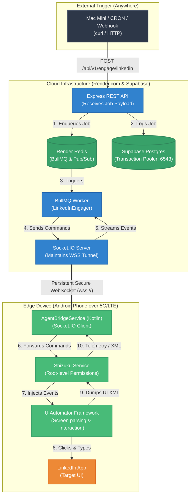

# Tokiyo Edge Automation: High-Level Design (HLD)

Here is the High-Level Design of the cloud-to-edge architecture we just successfully validated. This illustrates how a simple REST API call on your Mac Mini traverses the internet to physically control the LinkedIn app on your phone.

### Flow Walkthrough

1. **Trigger**: You send a standard HTTP POST request containing the `node_id` and the `target_id` to the Orchestrator on Render.
2. **Queueing**: The Express API immediately saves the job to Supabase (so we don't lose it if Render crashes) and drops it into the BullMQ Redis queue. The API returns an `ENQUEUED` response to you instantly.
3. **Processing**: The `LinkedInQueue` worker picks up the job. It initializes the `LinkedInEngager` workflow, which contains the step-by-step logic (open app, read UI, click button, type text).
4. **Execution over WSS**: The worker translates the logic into raw UIAutomator commands (`am start`, `input keyevent`, etc.) and sends them through the `Socket.IO` server over the open `wss://` tunnel to your specific phone's `node_id`.
5. **Edge Translation**: The `AgentBridgeService` running in the background of your Android phone receives the command payload. It forwards it to `Shizuku`, which bypasses normal Android security boundaries.
6. **Physical Action**: Shizuku executes the command directly in the Android OS using `UIAutomator`. The screen turns on, apps launch, and text is typed as if a ghost is holding your phone!
7. **Telemetry Loop**: After every action, Shizuku dumps the UI screen state (XML) and sends it *back up* the WebSocket to the worker in the cloud, allowing the AI/Engager to decide what to do next.

### Why is this process so intensive?

To reliably automate the LinkedIn app without triggering bot detection, the Orchestrator has to reverse-engineer human UI interaction in real-time. Because there is no simple "click the comment button" API available, the Orchestrator must execute a high volume of back-and-forth commands for every single action. 

A standard workflow looks like this:
1. **Command:** "Give me a dump of the screen."
2. **Scan:** Parse the massive XML file to find the exact X and Y pixel coordinates of the "Comment" button.
3. **Command:** "Tap the screen at pixel (720, 2960)."
4. **Wait:** Pause for 2 seconds to let the keyboard animation finish.
5. **Command:** "Type this exact string of text."
6. **Command:** "Give me another dump of the screen so I can find the submit button."

*Note: For now, we are prioritizing a robust mechanism over speed. We will move to optimizing these steps later.*

### The Role of the Spike App (`shizuku-spike-sandbox`)

The Spike App acts as the **"hands and eyes"** of the cloud agent on the physical Android device. 

- **The Cloud Orchestrator** is the **"Brain"**. It runs on Render, makes decisions, parses UI dumps, and figures out the sequence of steps.
- **The Spike App** is the **"Body"**. It sits on your phone, maintains a persistent WebSocket connection to the Brain, and waits for instructions.

The Spike App handles strictly low-level, physical functions using Shizuku (a tool that grants elevated system permissions):
- **Vision (`ui_dump`)**: Captures the current UI hierarchy (XML) of whatever is on your screen and sends it back to the Brain.
- **Movement (`shell`)**: Executes physical taps, swipes, and keyboard typing exactly where the Brain tells it to.
- **Navigation (`deep_link`)**: Forces the Android OS to open specific apps or URLs.
