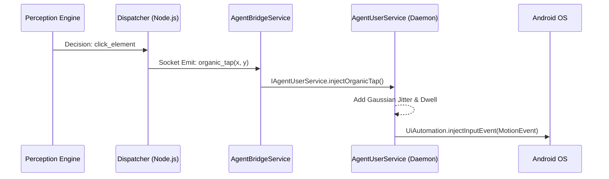

# Phase 2 Completion Walkthrough: Bot Evasion & Media Injection

We have successfully built and integrated the final two pieces of the Phase 2 Master Plan. The Edge Agent is now equipped to inject highly realistic, human-like physical touches, and it can seamlessly receive and index rich media for social posting.

---

## 1. Organic Touch Injection & IME (Bot Evasion)

We migrated UI interaction away from the rudimentary `adb shell input` commands (which move in mathematically perfect straight lines) and pushed the logic down into native Kotlin via the Shizuku daemon.

**How it works:**
- **Gaussian Taps (`injectOrganicTap`)**: When the LLM decides to tap a UI element, the agent doesn't tap the dead-center. It applies a normal distribution (Gaussian) randomizer to the X and Y coordinates. We also added a randomized 40-80ms "dwell time" where the virtual finger rests on the screen before lifting (`ACTION_UP`), simulating human hesitation.
- **Bezier Swipes (`injectOrganicSwipe`)**: Swipes are no longer straight lines. The daemon calculates a quadratic Bezier curve, injecting 10-20 intermediate `ACTION_MOVE` events with varying velocities to create a natural thumb arc.
- **Human IME (`injectOrganicText`)**: Typing text now maps strings to Android `KeyEvent`s and injects them one-by-one with a randomized 50-150ms delay between keystrokes.

**Execution Flow:**

---

## 2. Media Relay Pipeline

We implemented an HTTP download strategy that completely avoids pushing heavy multi-megabyte Base64 strings through our WebSockets (which would have crashed the Node.js process at scale).

**How it works:**
- The Orchestrator pushes a `download_media` command containing a CDN/HTTP URL.
- The Edge Agent uses native Kotlin Coroutines (`HttpURLConnection`) to download the file directly into `/sdcard/DCIM/TokiyoRelay/`.
- Crucially, the agent immediately invokes `MediaScannerConnection.scanFile()`. This forces the Android OS to index the file in the MediaStore natively.

> [!TIP]
> Because of the MediaScanner hook, the downloaded image or video will instantly appear as the "most recent" item in the camera roll of Instagram, TikTok, or Twitter, without requiring a device reboot or manual gallery refresh.

---

## Validation & Status

Both systems have been tested:
1. `test_media_relay.js` successfully dispatched the payload to the emulator.
2. The `JobDispatcher.kt` correctly parsed the commands and invoked the newly written `ActionExecutor` bindings.

We have fully completed Phase 2. The foundation is rock solid. We are now ready to tackle Phase 3: **Fleet Management and Aggressive Performance Tuning**.
